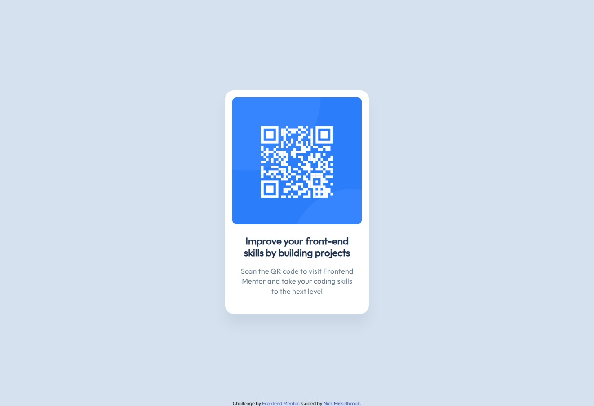

# Frontend Mentor - QR code component solution

This is a solution to the [QR code component challenge on Frontend Mentor](https://www.frontendmentor.io/challenges/qr-code-component-iux_sIO_H). Frontend Mentor challenges help you improve your coding skills by building realistic projects. 

## Table of contents

- [Overview](#overview)
  - [Screenshot](#screenshot)
  - [Links](#links)
- [My process](#my-process)
  - [Built with](#built-with)
  - [What I learned](#what-i-learned)

## Overview

A challenge set at the beginning of Frontend Mentor to create a QR Code Component based on their designs.

I have previously done this challenge before, but I decided to start again to test my development.

### Screenshot

### Links

- Solution URL: [GitHub Repo](https://github.com/nickmbk/fm-qr-code)
- Live Site URL: [GitHub Pages](https://nickmbk.github.io/fm-qr-code/)

## My process

I built out the component in HTML first and then changed the styling piece by piece to get the desired look.

### Built with

- HTML5
- CSS

### What I learned

That I still struggle with handling images, most particularly the sizing of them, overlapping it's containing parent/s.  Where I work right now, this is all set up out of the box on a new build, so I never have to think about it, as well as other things. I need to revisit a lot of stuff, mostly the basics, that these days I don't have to think about.
